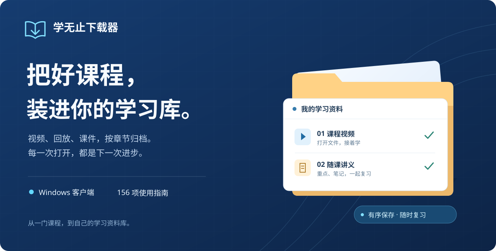

<div align="center">



# 学无止下载器

### 把课程留在电脑，把学习带在身边。

**网课视频下载 · 课件下载 · 直播回放保存 · 三分屏课程处理**

<p>
  <a href="https://github.com/Xue-Wu-Zhi/xuewuzhi-downloader/releases/latest"></a>
  <a href="docs/wiki/Platforms.md"></a>
  <a href="LICENSE"></a>
</p>

**[⬇ 下载 Windows 客户端](https://github.com/Xue-Wu-Zhi/xuewuzhi-downloader/releases/latest)**　 · 　**[📖 使用 Wiki](https://github.com/Xue-Wu-Zhi/xuewuzhi-downloader/wiki)**　 · 　**[🌐 官方网站](https://www.xuewuzhi.cn/downloader)**

[快速开始](#三步开始离线学习) · [下载类型](#支持下载的内容类型) · [支持平台](#找到你的课程平台) · [常见问题](#网课下载常见问题) · [开发者入口](#给开发者一份干净的起点) · [English](README.en.md)

</div>

---

**学无止下载器（Xuewuzhi Downloader）**是一款面向 Windows 的**网课视频下载与课件整理工具**，用于保存有权访问的课程视频、直播回放、音频和配套资料，并处理支持格式的板书、三分屏课程。中国大学 MOOC、超星学习通、学堂在线、智慧树、网易云课堂、钉钉等入口的操作方法见[平台视频下载教程](docs/wiki/Platforms.md)。

保存后按课程和章节查找，让下一次复习从打开文件夹开始。客户端版本与运行要求见[产品信息](docs/wiki/Product-Overview.md)。

> **来下载软件？** 前往 [Releases](https://github.com/Xue-Wu-Zhi/xuewuzhi-downloader/releases/latest) 获取官方 Windows 客户端。
>
> **来了解项目或参与开发？** 本仓库开放文档、平台目录与可运行的离线代码骨架，采用 MIT 许可。官方客户端的核心引擎、账号系统和平台适配实现不在仓库内；克隆源码不会获得完整下载器。[查看开源范围](docs/wiki/Open-Source-Scope.md)

## 支持下载的内容类型


| 下载类型 | 可以做什么 | 可用范围 | 图文教程 |
| :--- | :--- | :--- | :--- |
| **课程视频 / 录播** | 保存课节视频，按课程与章节整理 | 支持入口中账号可访问的视频 | [视频下载](docs/wiki/Video-and-Audio.md) |
| **直播回放** | 保存已经生成并开放的课程回放 | 需原平台提供回放访问权限 | [回放保存](docs/wiki/Video-and-Audio.md) |
| **音频课程** | 保存课程提供的音频内容 | 取决于平台与课节资源 | [音频下载](docs/wiki/Video-and-Audio.md) |
| **课件 / 讲义** | 下载 PDF、PPT、文档等随课资料 | 需课程实际提供对应附件 | [课件下载](docs/wiki/Courseware.md) |
| **三分屏课程** | 处理支持的教师画面、课件与板书内容 | 仅限支持的课程格式；等待处理完成 | [三分屏处理](docs/wiki/Board-and-Conversion.md) |
| **白板 / 板书** | 整理或转换支持的板书课程 | 依赖原课程资源与支持的处理方式 | [板书转换](docs/wiki/Board-and-Conversion.md) |
| **MP4 / MP3 / M3U8 链接** | 处理有效媒体地址，按提示下载或合并 | 地址有效且具有访问权限 | [媒体直链](docs/wiki/Platform-media_links.md) |
| **HTML / URL 转 MP4** | 将支持的课程播放内容转换为 MP4 | 不适用于任意网页；需资源完整 | [课程转换](docs/wiki/Board-and-Conversion.md) |

部分入口还提供**批量链接、多课程选择和章节归档**；没有合适专用入口时，可了解[万能下载模式](docs/wiki/Universal-Mode.md)的适用范围。

**这些是官方客户端的功能说明。** 本仓库中的 Python 示例只展示数据结构、组件边界和虚构课程目录，不实现以上下载能力。平台改版、课程权限和内容开放状态会影响实际结果。

## 三步开始离线学习

### 1. 下载客户端

打开 **[最新 Release](https://github.com/Xue-Wu-Zhi/xuewuzhi-downloader/releases/latest)**，选择 `xuewuzhi-downloader-2.19.54-windows.exe`。这是 Windows 客户端；GitHub 自动生成的 `Source code` 压缩包是本仓库的开源骨架。

### 2. 找到课程

在客户端首页输入 **A** 打开平台列表，选择实际使用的课程平台；也可以在支持链接的入口粘贴课程地址。按提示登录自己的课程账号，核对课程和期次。

### 3. 选择、保存、复习

选择课程、章节与可用内容类型，确认保存目录。等下载与合并、转换全部完成后，检查文件并开始离线复习。

**[查看完整入门指南](docs/wiki/Getting-Started.md)**　 · 　[安装与校验](docs/wiki/Installation.md)　 · 　[遇到问题](docs/wiki/Troubleshooting.md)

<details>
<summary><strong>下载后，课程目录可以是什么样？</strong></summary>

下面是虚构课程的归档示意，实际目录随平台而变化：

```text
我的学习资料/
└── 示例课程 · 学习方法入门/
    ├── 01 建立学习计划/
    │   ├── 01 学习目标.mp4
    │   └── 02 练习讲义.pdf
    └── 02 回顾与复习/
        ├── 01 章节回顾.mp4
        └── 02 复习音频.mp3
```

</details>

## 找到你的课程平台

下表来自官网 **2026-10-01 的公开教程目录**，共 **156 项指南**：151 项平台类教程，以及 5 项链接或转换工具教程。同一品牌的 PC、App 或产品线可能分别列出；这些数量不等于独立平台数量，也不代表所有入口已在当前版本逐项测试。

| 分类 | 常见入口 | 指南数 |
| :--- | :--- | ---: |
| 高校与公共课程 | 中国大学 MOOC、学堂在线、超星学习通、智慧树、智慧职教、爱课程 | 15 |
| 网课与学习平台 | 有道精品课、高途、学而思、粉笔、橙啦、网易云课堂 | 128 |
| 会议与企业培训 | 钉钉、ClassIn、腾讯会议、飞书、火苗会议 | 8 |
| 链接与本地转换 | 媒体直链、HTML / URL 转 MP4、百家云转码、万能下载模式 | 5 |

<details>
<summary><strong>网课与学习平台：视频下载与使用教程</strong></summary>

[网易云课堂视频下载](docs/wiki/Platform-study163.md) · [有道精品课视频下载](docs/wiki/Platform-youdao.md) · [有道领世视频下载](docs/wiki/Platform-ydshengxue.md) · [高途雅思视频下载](docs/wiki/Platform-todoen.md) · [高途视频下载](docs/wiki/Platform-gaotu.md) · [途途课堂视频下载](docs/wiki/Platform-tutu.md) · [高途高中规划视频下载](docs/wiki/Platform-gaotugaozhong.md) · [高途素养视频下载](docs/wiki/Platform-gaotusuyang.md) · [希望学视频下载](docs/wiki/Platform-xiwang.md) · [希望学素养视频下载](docs/wiki/Platform-xiwangsuyang.md) · [希望优课视频下载](docs/wiki/Platform-xiwangyouke.md) · [中公网校视频下载](docs/wiki/Platform-eoffcn.md) · [伯索云学堂视频下载](docs/wiki/Platform-plaso.md) · [爱问云视频下载](docs/wiki/Platform-aiwenyun.md) · [家辉云视频下载](docs/wiki/Platform-jhpy.md) · [橙啦视频下载](docs/wiki/Platform-orangevip.md) · [抖音课堂视频下载](docs/wiki/Platform-xuelang.md) · [研途视频下载](docs/wiki/Platform-kaoyanvip.md) · [荔课视频下载](docs/wiki/Platform-lizhiweike.md) · [海豚知道视频下载](docs/wiki/Platform-htknow.md) · [乐读视频下载](docs/wiki/Platform-ledu.md) · [千聊视频下载](docs/wiki/Platform-qlchat.md) · [兴趣岛视频下载](docs/wiki/Platform-xingqudao.md) · [小鹅通(PC端)视频下载](docs/wiki/Platform-xiaoetech.md) · [新东方在线视频下载](docs/wiki/Platform-koolearn.md) · [新东方云教室视频下载](docs/wiki/Platform-roombox.md) · [小鹅通(APP端)视频下载](docs/wiki/Platform-xiaoeapp.md) · [好课在线视频下载](docs/wiki/Platform-haozaixian.md) · [环球网校视频下载](docs/wiki/Platform-hqwx.md) · [库课网校视频下载](docs/wiki/Platform-kuke.md) · [学而思网校视频下载](docs/wiki/Platform-xueersi.md) · [学而思培优视频下载](docs/wiki/Platform-speiyou.md) · [学家云视频下载](docs/wiki/Platform-xuejiayun.md) · [之了课堂视频下载](docs/wiki/Platform-zlketang.md) · [昭昭医考视频下载](docs/wiki/Platform-zhaozhao.md) · [华尔街学堂视频下载](docs/wiki/Platform-wallstreets.md) · [人人讲视频下载](docs/wiki/Platform-renrenjiang.md) · [三节课视频下载](docs/wiki/Platform-sanjieke.md) · [易知课堂视频下载](docs/wiki/Platform-yizhiknow.md) · [达内慕课网视频下载](docs/wiki/Platform-tmooc.md) · [51CTO学堂视频下载](docs/wiki/Platform-cto51.md) · [哎上课视频下载](docs/wiki/Platform-aishangke.md) · [正保医学视频下载](docs/wiki/Platform-med66.md) · [正保会计视频下载](docs/wiki/Platform-zhengbao.md) · [正保建设工程视频下载](docs/wiki/Platform-jianshe99.md) · [233网校视频下载](docs/wiki/Platform-wangxiao233.md) · [中大网校视频下载](docs/wiki/Platform-wangxiao.md) · [海洋知道视频下载](docs/wiki/Platform-haiyangknow.md) · [敏试教师视频下载](docs/wiki/Platform-minshi.md) · [云端课堂视频下载](docs/wiki/Platform-yunduan.md) · [开明致学视频下载](docs/wiki/Platform-kaimingzhixue.md) · [金榜时代视频下载](docs/wiki/Platform-jinbangshidai.md) · [超格教育视频下载](docs/wiki/Platform-chaoge.md) · [粉笔视频下载](docs/wiki/Platform-fenbi.md) · [一笑而过视频下载](docs/wiki/Platform-yixiaoerguo.md) · [百家云校视频下载](docs/wiki/Platform-baijiayunxiao.md) · [燃领视频下载](docs/wiki/Platform-ranling.md) · [CCtalk视频下载](docs/wiki/Platform-cctalk.md) · [虎课网视频下载](docs/wiki/Platform-huke88.md) · [哇题库视频下载](docs/wiki/Platform-wowtiku.md) · [洋葱学院视频下载](docs/wiki/Platform-yangcong.md) · [墨督督视频下载](docs/wiki/Platform-mddclass.md) · [创客匠人视频下载](docs/wiki/Platform-ckjr.md) · [短书视频下载](docs/wiki/Platform-duanshu.md) · [有赞视频下载](docs/wiki/Platform-youzan.md) · [山香教育视频下载](docs/wiki/Platform-shanxiang.md) · [码士集团视频下载](docs/wiki/Platform-mashibing.md) · [厚读视频下载](docs/wiki/Platform-houdu.md) · [柠檬云课堂视频下载](docs/wiki/Platform-nmkjxy.md) · [华图在线视频下载](docs/wiki/Platform-huatu.md) · [阿虎医考视频下载](docs/wiki/Platform-ahu.md) · [问到课堂视频下载](docs/wiki/Platform-wendao.md) · [财学堂视频下载](docs/wiki/Platform-caixuetang.md) · [乐学云课堂视频下载](docs/wiki/Platform-lexueyun.md) · [邢帅教育视频下载](docs/wiki/Platform-xsteach.md) · [马哥教育视频下载](docs/wiki/Platform-magedu.md) · [精通课堂视频下载](docs/wiki/Platform-jingtongxue.md) · [厚大法考视频下载](docs/wiki/Platform-houda.md) · [启航教育视频下载](docs/wiki/Platform-qihang.md) · [路飞学城视频下载](docs/wiki/Platform-luffycity.md) · [公选王视频下载](docs/wiki/Platform-gongxuanwang.md) · [北辰遴选视频下载](docs/wiki/Platform-beichenlinxuan.md) · [医开讲视频下载](docs/wiki/Platform-yikaijiang.md) · [加图会计视频下载](docs/wiki/Platform-canto.md) · [中讯网校视频下载](docs/wiki/Platform-zhongxunwx.md) · [一起考教师视频下载](docs/wiki/Platform-yiqikaojiaoshi.md) · [希赛网视频下载](docs/wiki/Platform-educity.md) · [羽课帮视频下载](docs/wiki/Platform-yukebang.md) · [研直播视频下载](docs/wiki/Platform-yanxiu.md) · [小猿优课视频下载](docs/wiki/Platform-xiaoyuanyouke.md) · [事考帮视频下载](docs/wiki/Platform-shikaobang.md) · [丁香园视频下载](docs/wiki/Platform-dxy.md) · [墨尔冥想视频下载](docs/wiki/Platform-moremeditation.md) · [大招魔方视频下载](docs/wiki/Platform-dazhaomofang.md) · [作业帮视频下载](docs/wiki/Platform-zuoyebang.md) · [百战未来视频下载](docs/wiki/Platform-itbaizhan.md) · [志道优学视频下载](docs/wiki/Platform-zhidao.md) · [翼狐网视频下载](docs/wiki/Platform-yiihuu.md) · [获课视频下载](docs/wiki/Platform-huoke.md) · [百通在线视频下载](docs/wiki/Platform-baitong.md) · [本质筑安视频下载](docs/wiki/Platform-benzhixt.md) · [小黑课堂视频下载](docs/wiki/Platform-xiaoheiketang.md) · [我要自学网视频下载](docs/wiki/Platform-zxw51.md) · [质心教育视频下载](docs/wiki/Platform-eduzhixin.md) · [卫人医考视频下载](docs/wiki/Platform-wrclass.md) · [有猿医考视频下载](docs/wiki/Platform-youyuan.md) · [银成医考视频下载](docs/wiki/Platform-yincheng.md) · [看点微课视频下载](docs/wiki/Platform-kandian.md) · [电气帮视频下载](docs/wiki/Platform-dqb.md) · [友课云视频下载](docs/wiki/Platform-youkeyun.md) · [中企教育视频下载](docs/wiki/Platform-zqzh.md) · [上岸视频下载](docs/wiki/Platform-shangan.md) · [拔尖优生视频下载](docs/wiki/Platform-bajianyousheng.md) · [星火教育视频下载](docs/wiki/Platform-xinghuo.md) · [星火英语视频下载](docs/wiki/Platform-sparke.md) · [优路教育视频下载](docs/wiki/Platform-youlu.md) · [乐学培优视频下载](docs/wiki/Platform-lexuepeiyou.md) · [美森教育视频下载](docs/wiki/Platform-mison.md) · [自学帮视频下载](docs/wiki/Platform-zixueb.md) · [家辉教育视频下载](docs/wiki/Platform-jhpyedu.md) · [1998课堂视频下载](docs/wiki/Platform-xuexi1998.md) · [高豆豆视频下载](docs/wiki/Platform-gaodoudou.md) · [极客时间视频下载](docs/wiki/Platform-geekbang.md) · [SiKi学院视频下载](docs/wiki/Platform-sikiedu.md) · [猿辅导素养课视频下载](docs/wiki/Platform-yuanfudaosuyang.md) · [学天教育视频下载](docs/wiki/Platform-xuetian.md) · [誉优在线视频下载](docs/wiki/Platform-yuyou.md) · [扑课网校视频下载](docs/wiki/Platform-pukewx.md)

[完整平台与工具表](docs/wiki/Platforms.md)

</details>

<details>
<summary><strong>会议与企业培训：视频下载与使用教程</strong></summary>

[钉钉群与钉钉链接视频下载](docs/wiki/Platform-dingtalk.md) · [ClassIn视频下载](docs/wiki/Platform-classin.md) · [腾讯会议视频下载](docs/wiki/Platform-meeting.md) · [飞书视频下载](docs/wiki/Platform-feishu.md) · [51CTO企业版视频下载](docs/wiki/Platform-cto51_saas.md) · [火苗会议视频下载](docs/wiki/Platform-huomiao.md) · [钉钉云学堂视频下载](docs/wiki/Platform-dingtalk_yunxuetang.md) · [钉钉云课堂视频下载](docs/wiki/Platform-dingtalk_yunketang.md)

[完整平台与工具表](docs/wiki/Platforms.md)

</details>

<details>
<summary><strong>高校与公共课程：视频下载与使用教程</strong></summary>

[中国大学 MOOC（慕课）视频下载](docs/wiki/Platform-icourse163.md) · [学银在线视频下载](docs/wiki/Platform-xueyinonline.md) · [网易公开课视频下载](docs/wiki/Platform-open163.md) · [超星学习通视频下载](docs/wiki/Platform-chaoxing.md) · [智慧树视频下载](docs/wiki/Platform-zhihuishu.md) · [智慧职教视频下载](docs/wiki/Platform-icve.md) · [智慧中小学视频下载](docs/wiki/Platform-smartedu.md) · [学堂在线视频下载](docs/wiki/Platform-xuetangx.md) · [爱课程视频下载](docs/wiki/Platform-icourses.md) · [外语慕课平台视频下载](docs/wiki/Platform-unipus.md) · [华文慕课视频下载](docs/wiki/Platform-chinesemooc.md) · [好大学在线视频下载](docs/wiki/Platform-cnmooc.md) · [雨课堂视频下载](docs/wiki/Platform-yuketang.md) · [CCTV央视频视频下载](docs/wiki/Platform-cctv.md) · [高校教师网培中心视频下载](docs/wiki/Platform-enetedu.md)

[完整平台与工具表](docs/wiki/Platforms.md)

</details>

<details>
<summary><strong>链接与本地转换：视频下载与使用教程</strong></summary>

[HTML转MP4使用教程](docs/wiki/Platform-html_to_mp4.md) · [URL转MP4使用教程](docs/wiki/Platform-url_to_mp4.md) · [百家云链接使用教程](docs/wiki/Platform-baijiayun.md) · [万能下载模式使用教程](docs/wiki/Platform-universal.md) · [MP4、MP3 与 M3U8 链接使用教程](docs/wiki/Platform-media_links.md)

[完整平台与工具表](docs/wiki/Platforms.md)

</details>

**[查看完整支持平台表与图文教程](docs/wiki/Platforms.md)**　 · 　[官网教程目录](https://www.xuewuzhi.cn/tutorials)

## 网课下载常见问题

### 怎么下载网课视频和课件？

下载[官方 Windows 客户端](https://github.com/Xue-Wu-Zhi/xuewuzhi-downloader/releases/latest)，选择实际使用的平台，登录有课程权限的账号，再选择章节、视频或课件和保存位置。下载、合并或转换结束后核对输出。[图文入门](docs/wiki/Getting-Started.md)

### 支持哪些平台的视频下载？

公开目录覆盖高校课程、网课学习、会议与企业培训等入口；[支持平台表](docs/wiki/Platforms.md)逐项列出名称、入口和教程。同一品牌可能有不同产品线入口，实际可用内容取决于课程与账号权限。

### 三分屏课程能下载成视频吗？

支持的三分屏或板书课程可以按对应入口进行处理或转换；必须等待媒体和板书等处理完成，并检查成片。输入格式和资源不符合要求时，不能保证生成完整视频。[三分屏图解](docs/wiki/Board-and-Conversion.md)

### GitHub 源码和完整客户端下载有什么区别？

本仓库提供 MIT 许可的公开文档与离线骨架。需要实际下载功能，请获取 Releases 中的 Windows 客户端；源码包不包含官方核心引擎。[产品信息与开源范围](docs/wiki/Product-Overview.md)

## 需要哪份说明，直接打开

| 刚开始使用 | 处理课程内容 | 排查问题与参与开发 |
| :--- | :--- | :--- |
| [安装与运行](docs/wiki/Installation.md) | [课程列表与章节选择](docs/wiki/Courses-and-Selection.md) | [常见问题](docs/wiki/FAQ.md) |
| [三步开始](docs/wiki/Getting-Started.md) | [视频、音频与回放](docs/wiki/Video-and-Audio.md) | [排错指南](docs/wiki/Troubleshooting.md) |
| [账号与登录](docs/wiki/Login-and-Accounts.md) | [课件与附件](docs/wiki/Courseware.md) | [组件与架构](docs/wiki/Architecture.md) |
| [平台索引](docs/wiki/Platforms.md) | [板书、三分屏与转换](docs/wiki/Board-and-Conversion.md) | [开发与贡献](CONTRIBUTING.md) |
| [版本与文件校验](docs/wiki/Release-and-Checksums.md) | [目录与本地播放](docs/wiki/Files-and-Playback.md) | [开源范围](docs/wiki/Open-Source-Scope.md) |

## 给开发者，一份干净的起点

这是一份独立编写、可本地运行的 **Python 架构示例**。你可以阅读类型定义、运行离线演示、查询公开平台目录，或参与完善文档。它不连接课程服务，不读取浏览器会话，也不下载课程。

```text
xuewuzhi-downloader/
├── xuewuzhi_downloader/
│   ├── models.py          # 课程、章节、资源和进度数据类型
│   ├── interfaces.py      # 课程提供方与下载引擎的抽象约定
│   ├── demo.py            # 虚构课程及目录展示
│   ├── cli.py             # 离线示例和公开目录查询
│   └── data/              # 可公开的平台介绍数据
├── docs/wiki/             # 完整 Wiki 的可审阅副本
├── docs/releases/         # 版本说明
├── assets/                # 原创说明图
├── scripts/               # 公开文件检查
└── tests/                 # 离线行为与泄露防护检查
```

需要 **Python 3.9+**。从源码目录运行，无需第三方运行时依赖：

```bash
git clone https://github.com/Xue-Wu-Zhi/xuewuzhi-downloader.git
cd xuewuzhi-downloader
python -m xuewuzhi_downloader demo
python -m xuewuzhi_downloader platforms --query MOOC
```

| 组件 | 本仓库状态 | 作用 |
| :--- | :--- | :--- |
| 课程 / 章节 / 资源模型 | 已提供 | 展示一门课程的数据组织方式 |
| 课程提供方接口 | 仅接口 | 约定示例课程数据的提供方式 |
| 下载引擎接口 | 仅接口 | 表达组件边界，不含实际引擎 |
| 离线演示与命令行 | 可运行 | 打印虚构目录、检索公开指南 |
| 平台文档与 Wiki | 已提供 | 面向使用者的操作参考 |
| 平台登录、解析与资源下载 | 未公开 | 由官方客户端提供 |

示例接口并非官方客户端的插件 SDK，也不承诺与内部接口兼容。[架构说明](docs/wiki/Architecture.md) · [开发指南](docs/wiki/Development.md)

## 版本与下载

**官方 Windows 客户端：V2.19.54 · 2026-10-03**

本次版本完善万能下载与播放恢复。详细内容见 [Release 说明](docs/releases/v2.19.54.md)，文件校验见 [校验指南](docs/wiki/Release-and-Checksums.md)。公开骨架单独使用 `0.1.0` 版本号。

[**获取最新客户端**](https://github.com/Xue-Wu-Zhi/xuewuzhi-downloader/releases/latest)　 · 　[官网备用下载](https://www.xuewuzhi.cn/downloader)　 · 　[版本记录](CHANGELOG.md)

## 一起把学习体验做得更好

- **遇到问题**：[提交 Issue](https://github.com/Xue-Wu-Zhi/xuewuzhi-downloader/issues/new/choose)，附上版本、平台、复现步骤与脱敏错误提示。
- **文档可以更清楚**：欢迎修正教程、补充说明、改善示例和无障碍体验。
- **觉得有帮助**：欢迎 Star，让更多学习者找到这个项目。

公开代码与文档采用 [MIT License](LICENSE)；官方客户端及第三方组件的许可范围见 [NOTICE](NOTICE.md)。请仅处理自己有权访问、保存的课程内容，遵守课程提供方的授权要求；不要公开传播他人的课程或账号信息。

---

<div align="center">

**学无止境，温故知新。**

[官网](https://www.xuewuzhi.cn/downloader) · [下载](https://github.com/Xue-Wu-Zhi/xuewuzhi-downloader/releases/latest) · [Wiki](https://github.com/Xue-Wu-Zhi/xuewuzhi-downloader/wiki) · [反馈](https://github.com/Xue-Wu-Zhi/xuewuzhi-downloader/issues)

</div>
