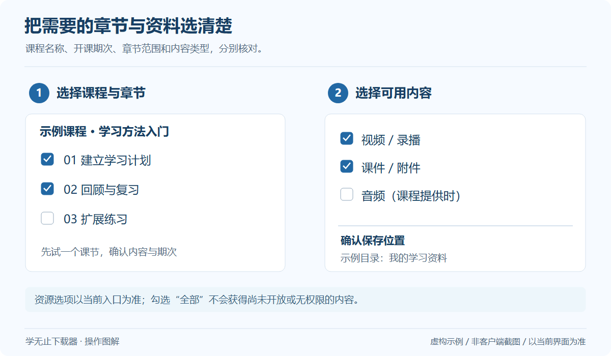

# 课程列表、期次与章节选择

## 先确定你选的是哪一门课

相似名称可能对应不同年份、班级或开课期次。选择前对照课程名称、所属产品和开课信息。大学 MOOC 等平台的旧期开课与新期开课不一定包含相同内容。

## 列表加载与多选

*通用操作示意，使用虚构数据；不是客户端截图，具体界面以当前版本为准。* [查看大图](../../assets/guides/select-course.png)

等待课程列表完成当前加载，再使用界面提供的搜索、章节选择或多选功能。不同平台入口提供的选择方式不同；有“批量”提示的入口与只接受单条链接的入口不能混用。

| 需求 | 操作要点 |
| --- | --- |
| 只保存一章 | 在章节选择中核对范围，确认后再开始 |
| 保存整门课程 | 检查全部章节是否已开放，资料是否另外选择 |
| 多条课程链接 | 使用明确支持批量链接的入口，按提示分行输入 |
| 多个班级或期次 | 分别核对身份和课程范围，避免选中同名课程 |
| 仅下载资料 | 只有入口提供相应类型选项时才选择该模式 |

## 课程数量与输出数量为何不同

一个课节可能包含多个视频和附件；也可能只是通知、练习或尚未开放的内容。课程列表数量、课节数量、媒体数量和文件数量不是同一个指标。

## 看起来缺课怎么办

1. 在原平台检查是否真的能进入缺失课程。
2. 对照登录账号、PC / App 入口及企业或班级。
3. 查看是否有期次、分类、分页或加载提示。
4. 重新加载后仍然缺失，记录平台名称、预期数量、实际数量与客户端版本。

不要提交整份含个人信息的课程清单。可以用脱敏名称和局部截图说明问题。[排错指南](Troubleshooting.md)
