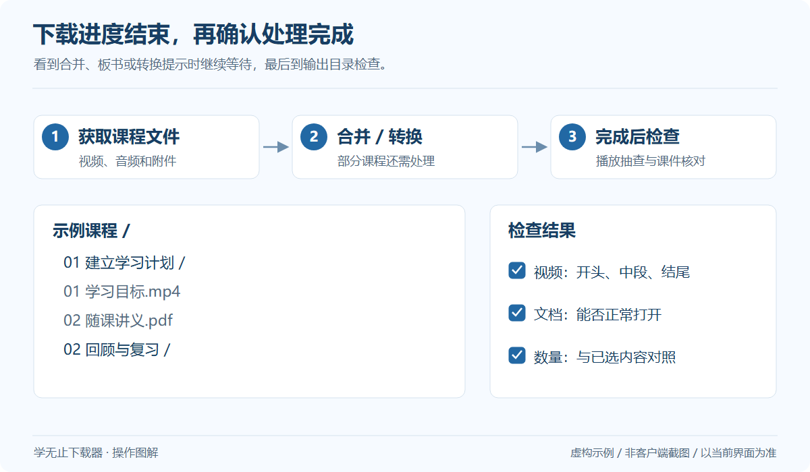

# 保存目录、文件命名与本地播放


## 目录如何组织

实际输出通常根据课程、章节或资源组织，具体命名由入口和课程内容决定。下面只展示一种便于复习的虚构示例：

```text
示例课程/
├── 01 基础概念/
│   ├── 01 课程导览.mp4
│   └── 02 随课讲义.pdf
└── 02 复习/
    └── 01 章节总结.mp4
```

## 建议的整理方式



*通用操作示意，使用虚构数据；不是客户端截图，具体界面以当前版本为准。* [查看大图](../../assets/guides/download-finish.png)

- 一门课程先使用独立目录，方便核对期次和资源完整性。
- 等任务完成后再移动课程目录，避免正在运行的任务找不到文件。
- 保留章节序号，按名称排序时更容易顺序复习。
- 需要自行重命名时，先保留一份目录清单，便于追溯原课节。

## 播放列表

部分输出可能包含播放器列表文件。若获得 `.dpl` 文件，可用支持该格式的播放器打开。目录移动后列表中的路径可能失效；如果该输出自带修复入口，按其说明操作，或从新的文件夹位置重新建立列表。并非所有平台都会生成列表或修复脚本。

## 文件为什么不完整

先确认客户端已结束合并或转换；比较选择范围和原平台实际资源。小体积文件不一定异常，但明显无法播放、时长过短或文档打不开时，应记录具体课节和错误。

## 保管资料

个人学习资料应按课程提供方授权保存和使用。不要把课程媒体、账号缓存或含鉴权参数的文件清单提交到公开仓库。
