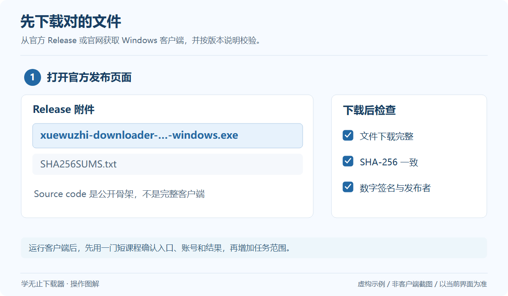
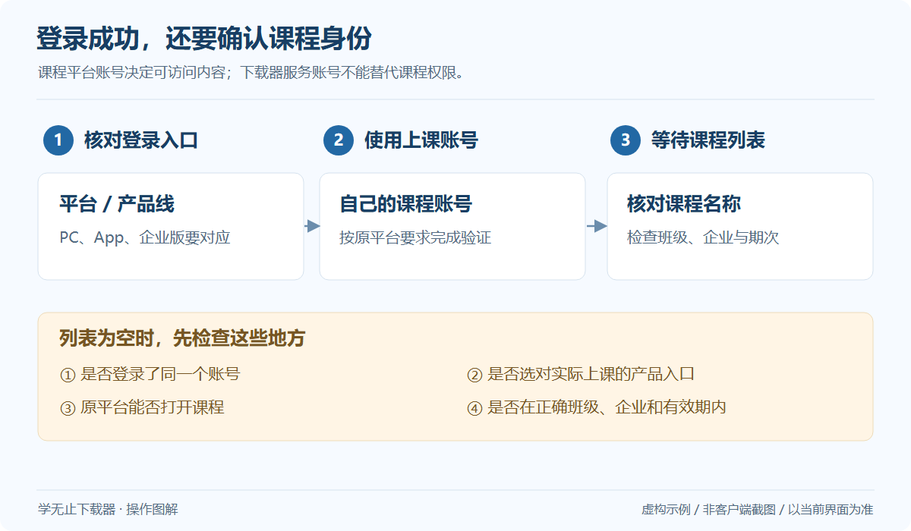
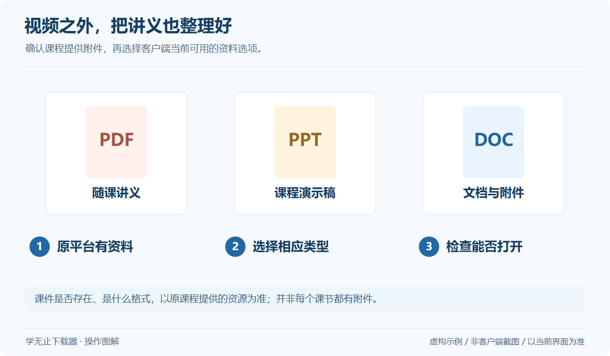
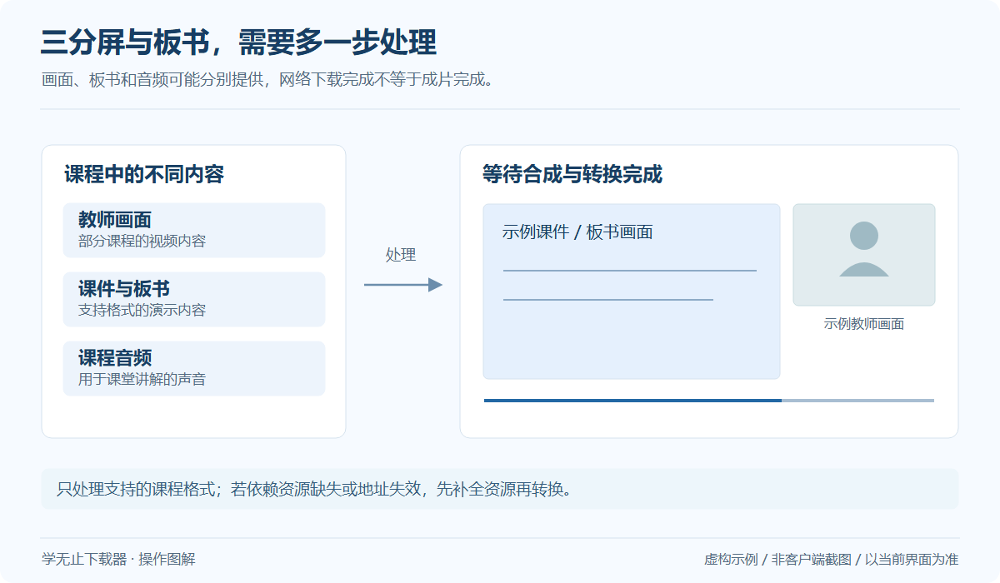
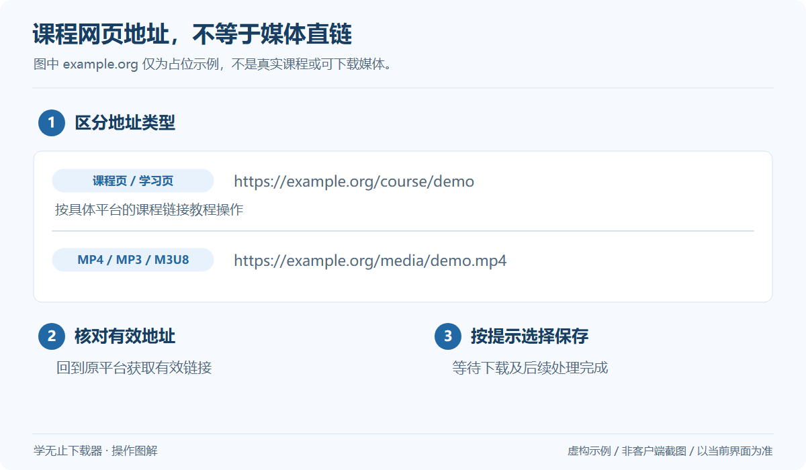
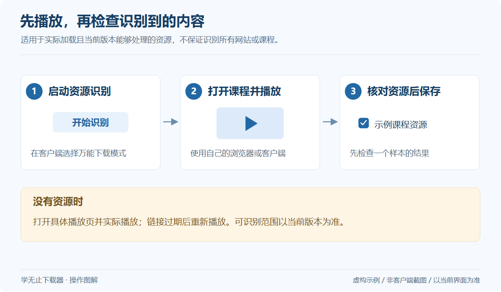

# 网课视频下载操作图解

这组图示说明从下载软件到检查课程文件的常见流程。图片使用虚构课程和资料，便于理解操作；客户端的真实界面、按钮与可用选项以当前版本为准。

## 1. 安装客户端

下载 Windows 发布包，核对哈希与发布者

*通用操作示意，使用虚构数据；不是客户端截图，具体界面以当前版本为准。* [查看大图](../../assets/guides/installation.png)

[查看详细步骤](Installation.md)

## 2. 选择平台或链接入口

无网址从平台列表开始；有网址按平台教程使用

*通用操作示意，使用虚构数据；不是客户端截图，具体界面以当前版本为准。* [查看大图](../../assets/guides/choose-entry.png)

[查看详细步骤](Getting-Started.md)

## 3. 登录课程账号

确认实际上课账号、产品入口和课程权限

*通用操作示意，使用虚构数据；不是客户端截图，具体界面以当前版本为准。* [查看大图](../../assets/guides/login-course.png)

[查看详细步骤](Login-and-Accounts.md)

## 4. 勾选课程与内容

核对期次、章节与界面提供的资源选项

*通用操作示意，使用虚构数据；不是客户端截图，具体界面以当前版本为准。* [查看大图](../../assets/guides/select-course.png)

[查看详细步骤](Courses-and-Selection.md)

## 5. 保存课件和讲义

确认原平台提供资料，再选择相应附件

*通用操作示意，使用虚构数据；不是客户端截图，具体界面以当前版本为准。* [查看大图](../../assets/guides/courseware.png)

[查看详细步骤](Courseware.md)

## 6. 处理板书与三分屏

等待支持格式的资源处理和成片

*通用操作示意，使用虚构数据；不是客户端截图，具体界面以当前版本为准。* [查看大图](../../assets/guides/board-conversion.png)

[查看详细步骤](Board-and-Conversion.md)

## 7. 等待处理并检查结果

下载进度结束后，仍可能有合并或转换

*通用操作示意，使用虚构数据；不是客户端截图，具体界面以当前版本为准。* [查看大图](../../assets/guides/download-finish.png)

[查看详细步骤](Files-and-Playback.md)

## 8. 使用有效媒体地址

核对课程链接与媒体直链的区别

*通用操作示意，使用虚构数据；不是客户端截图，具体界面以当前版本为准。* [查看大图](../../assets/guides/link-entry.png)

[查看详细步骤](Platform-media_links.md)

## 9. 使用万能下载模式

实际播放内容后，再检查已识别的资源

*通用操作示意，使用虚构数据；不是客户端截图，具体界面以当前版本为准。* [查看大图](../../assets/guides/universal-mode.png)

[查看详细步骤](Universal-Mode.md)
