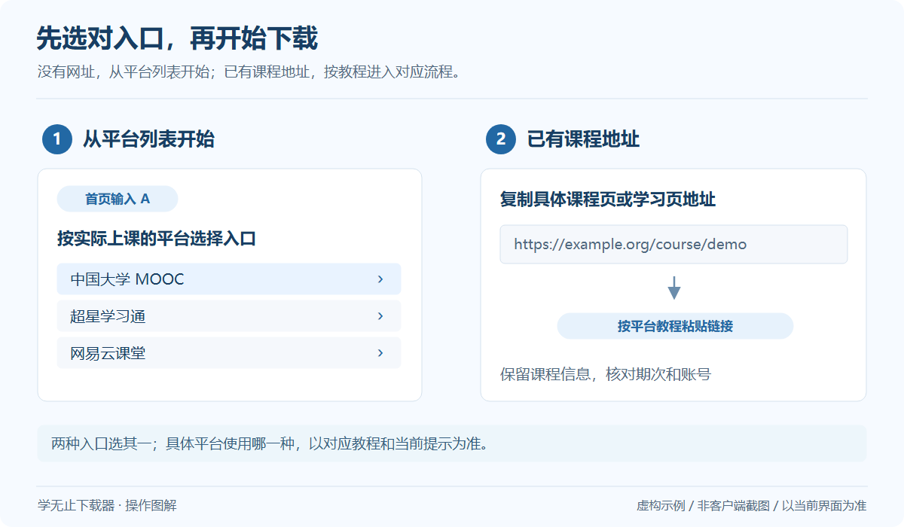

# 超星学习通视频下载教程

超星学习通课程链接的批量输入、课程账号验证、章节视频和资料下载说明。学银在线课程请核对对应入口。

**分类：** 高校与公共课程  
**客户端入口：** `超星学习通(批量)`

## 如何下载超星学习通视频？

下载超星学习通视频时，使用学无止官方 Windows 客户端，选择 `超星学习通(批量)`，并按教程提交课程链接，登录实际用于上课的账号，核对课程和章节后开始保存。可用视频、回放或课件以平台向当前账号开放的内容为准。

| 项目 | 说明 |
| --- | --- |
| 平台 / 工具 | 超星学习通 |
| 使用方式 | 平台列表 / 链接 |
| 运行环境 | 官方 Windows 客户端 |
| 资源范围 | 当前账号获准访问且平台已开放的内容 |
| 操作资料 | [官网公开教程](https://www.xuewuzhi.cn/chaoxing_downloader) · 快照 2026-10-01 |

## 开始之前

准备实际用于上课的账号，先确认原平台能够访问所需课程。客户端账号不替代课程平台的访问权限。

## 操作步骤

*通用操作示意，使用虚构数据；不是客户端截图，具体界面以当前版本为准。* [查看大图](../../assets/guides/choose-entry.png)

1. 在学习通对应的课程网页中打开自己有权限的课程，复制完整网址，保留 courseId、clazzid 等原有参数，不要只复制平台首页。
2. 在学无止下载器首页输入 A 并回车，选择“超星学习通(批量)”，每行粘贴一条课程链接并提交；单条课程链接也可直接粘贴到首页。
3. 按提示完成课程账号验证，核对学校、课程与班级，选择章节及可下载的视频、课件或资料，确认保存位置。
4. 等待下载与文件处理结束，检查结果目录；若部分内容缺失，先在原课程中确认相应章节已经开放且该账号可以访问。

## 这个入口的说明

- 课程、回放及资料是否可下载，以当前账号权限和平台实际开放的内容为准。

## 该平台的常见问题

### 为什么同名课程仍然无法读取？

同名课程可能属于不同学校、班级或期次。请使用自己实际进入课程后的完整网址，并核对登录账号的学校与班级权限，保留链接中的课程和班级参数。

### 学习通和学银在线应该选哪个入口？

根据实际课程网址和上课入口选择。学习通课程使用“超星学习通(批量)”；学银在线的课程可先选择“学银在线”对应入口。不要仅凭课程名称判断入口相同。

### 未解锁的章节可以直接下载吗？

章节是否可下载取决于当前账号权限和平台开放状态。先在原课程中确认能够访问；选择全部章节不会自动解锁未开放的内容。

## 完成后如何检查

确认任务的下载、合并或转换阶段均已结束，再打开输出文件。视频抽查开头、中间与结尾；文档检查能否正常打开。实际输出格式与资源数量以该课程返回的内容为准。

## 结果与预期不一致

先在原平台确认同一账号能够打开课程，再核对所用产品入口、课程期次和所选内容类型。只缺部分内容时，检查对应章节是否已经开放。

需要反馈时记录客户端版本、入口名称、问题发生步骤和脱敏错误提示。不要提供账号、验证码、Cookie、鉴权链接或课程媒体。可继续查阅[排错指南](Troubleshooting.md)。

## 参考与下一步

- [下载学无止官方 Windows 客户端](https://github.com/Xue-Wu-Zhi/xuewuzhi-downloader/releases/latest)
- [完整操作图解](Illustrated-Guide.md)
- [官网公开教程](https://www.xuewuzhi.cn/chaoxing_downloader)
- [完整平台索引](Platforms.md)
- [登录与账号](Login-and-Accounts.md)
- [课程与章节选择](Courses-and-Selection.md)

本页根据 2026-10-01 的官网公开教程整理。它介绍官方客户端的使用方式；本仓库不包含该入口的核心实现。平台更新后，操作与可用内容可能变化。
